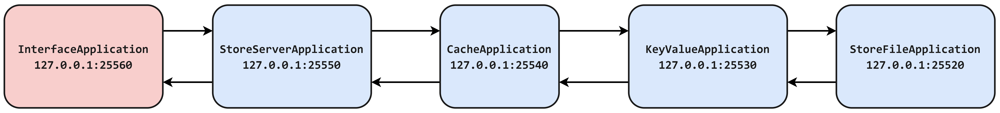

# Store System Project
## Design


## Running the application with sbt
* Run the store file actor
```bash
```bash
sbt "runMain com.dss.project.StoreFileApplication" 
```
* Run the key value store actor
```bash
sbt "runMain com.dss.project.KeyValueApplication" 
```
* Run the cache actor
```bash
sbt "runMain com.dss.project.CacheApplication" 
```
* Run the server
```bash
sbt "runMain com.dss.project.StoreServerApplication" 
```
* Run the interface (client)
```bash
sbt "runMain com.dss.project.InterfaceApplication" 
```
## Using the jar
* Run the store file actor
```bash
java -cp target/scala-2.13/seed-assembly-0.1.0-SNAPSHOT.jar com.dss.project.StoreFileApplication
```
* Run the key value store actor
```bash
java -cp target/scala-2.13/seed-assembly-0.1.0-SNAPSHOT.jar com.dss.project.KeyValueApplication
```
* Run the cache actor
```bash
java -cp target/scala-2.13/seed-assembly-0.1.0-SNAPSHOT.jar com.dss.project.CacheApplication
```
* Run the server
```bash
java -cp target/scala-2.13/seed-assembly-0.1.0-SNAPSHOT.jar com.dss.project.StoreServerApplication
```
* Run the interface (client)
```bash
java -cp target/scala-2.13/seed-assembly-0.1.0-SNAPSHOT.jar com.dss.project.InterfaceApplication
```

## JAR File
You can download the jar from this link [jar file](https://drive.google.com/drive/folders/1RCgqZcyemvWt4EM_Lx_wxY00SuixBKgN?usp=share_link).


## Artery Remoting
I didn't succeed in establishing a remote connection using Netty. After many attempts, I implemented the remote connection using Artery. I used the Akka documentation for Artery remoting (https://doc.akka.io/docs/akka/current/remoting-artery.html).
